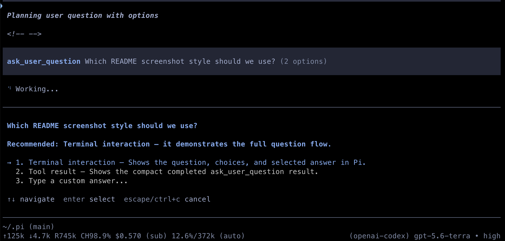

# My pi setup

Backup of my [pi](https://github.com/earendil-works/pi-coding-agent) agent
configuration: settings, custom skills, and npm dependency manifests.

## What's tracked

| Path | What |
|------|------|
| `agent/settings.json` | Default provider + model, theme, `packages[]` list |
| `agent/mcp-onboarding.json` | Onboarding flags |
| `agent/skills/` | Custom skills |
| `agent/npm/package.json` (+ lock) | pi npm extensions manifest |
| `packages/ask-user-question/` | Publishable `ask_user_question` Pi package |
| `packages/codex-limit-tracking-footer/` | Publishable Codex limit footer Pi package |
| `bootstrap.sh` | One-command restore on a new machine |

## Included Pi packages

### `@aneviaro/pi-ask-user-question`

A blocking clarification tool with multiple-choice and freeform answers.



```bash
pi install npm:@aneviaro/pi-ask-user-question
```

### `@aneviaro/pi-codex-limit-tracking-footer`

Adds a 5-hour/weekly Codex subscription-limit segment to Pi's footer, with semantic colors, stale-data handling, and `/codex-limits [refresh]` diagnostics. It uses Pi-managed OAuth credentials without persisting usage data.


```bash
pi install npm:@aneviaro/pi-codex-limit-tracking-footer
```

## What's deliberately NOT tracked (see `.gitignore`)

- **`agent/auth.json`** — ⚠️ live OAuth/API tokens. Never commit. Pi recreates
  this on first run via interactive login. A new machine's `auth.json` is left
  untouched by `bootstrap.sh`.
- **`agent/trust.json`** — machine-specific trusted-project paths (absolute).
  Kept local; each machine maintains its own. `bootstrap.sh` preserves it
  across the force checkout (backs up + restores), so it survives even on
  machines migrating from an older commit where it was tracked.
- **`agent/mcp-cache.json`** — regenerable MCP metadata cache.
- **`agent/sessions/`** — per-project conversation history (large, machine-local).
- **`agent/npm/node_modules/`** — rebuilt from `package.json` (~358 MB).
- **`agent/bin/`** — downloaded helper binaries. Pi re-fetches on demand.
- **`agent/git/`** — git-cloned skills/packages, re-fetched from `settings.json`
  `packages[]` on first run.
- **`context-mode/`** — SQLite knowledge-base DBs + per-pid session stats.

## Restoring on a new machine

`bootstrap.sh` is the single entry point. It handles all three starting
states (missing dir, existing repo, or existing non-empty dir where pi already
seeded defaults), then rebuilds npm extensions. Ignored files — including the
new machine's `auth.json` and `trust.json` — are never touched.

### Option A: curl-pipe (brand-new machine, after `git` + SSH key are set up)

```bash
bash -c "$(curl -fsSL \
  https://raw.githubusercontent.com/aneviaro/pipack/main/bootstrap.sh)"
```

### Option B: clone the repo, then run the helper

```bash
git clone git@github.com:aneviaro/pipack.git ~/.pi
cd ~/.pi && ./bootstrap.sh
```

### Option C: `~/.pi` already exists (pi already ran once → `git clone` fails)

This is the case where `git clone` reports
`fatal: destination path '~/.pi' already exists and is not an empty directory`,
or `git checkout` reports
`untracked working tree files would be overwritten`. Run `bootstrap.sh`
from anywhere — it does `git init` + remote + fetch + `checkout -f -B main`,
overwriting only the tracked files:

```bash
PI_REMOTE=git@github.com:aneviaro/pipack.git \
  bash -c "$(curl -fsSL \
    https://raw.githubusercontent.com/aneviaro/pipack/main/bootstrap.sh)"
```

Prefer HTTPS instead of SSH? Override `PI_REMOTE`:

```bash
PI_REMOTE=https://github.com/aneviaro/pipack.git bash bootstrap.sh
```

### After bootstrap — finish up

```bash
pi   # fetches agent/bin/ + agent/git/ (from settings.json packages[])
     # and prompts for OAuth to (re)create agent/auth.json
```

## Going forward — keeping it in sync

After any pi config change (new skill, settings tweak, package added):

```bash
cd ~/.pi && git add -A && git commit -m "update pi setup" && git push
```

`git add -A` is always safe — the allowlist `.gitignore` means new files under
`sessions/`, `node_modules/`, `context-mode/`, `trust.json`, or a refreshed
`auth.json` can never sneak in.

## Policy reminder

The `.gitignore` uses an **allowlist**: `*` ignores everything, then specific
files are opted back in with `!` rules. To track a new file, add a `!/path` line
to the OPT-INS section. **Never** allowlist `auth.json`, `trust.json`, or
anything under `sessions/`, `node_modules/`, `bin/`, `git/`, or `context-mode/`.
