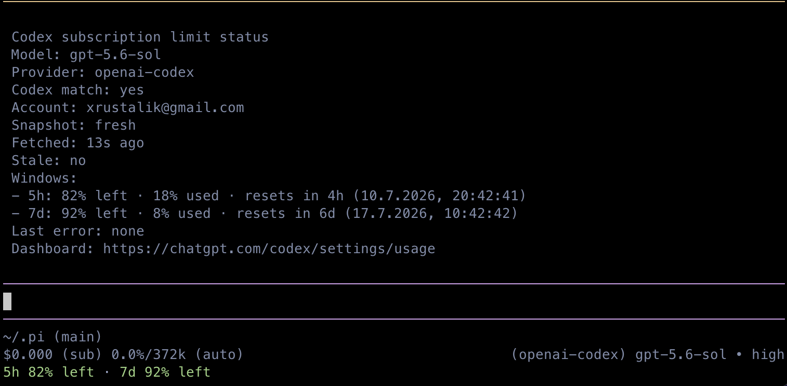

# @aneviaro/pi-codex-limit-tracking-footer

A Pi extension that adds a compact Codex subscription-limit segment to the default footer.



## Install

Install the published package globally:

```text
pi install npm:@aneviaro/pi-codex-limit-tracking-footer@0.1.0
```

For local development or testing:

```text
pi -e ./packages/codex-limit-tracking-footer
# or
pi install ./packages/codex-limit-tracking-footer
```

The package supports Pi 0.80.6+ and Node.js 20+.

## Behavior

For an active Pi-managed `openai-codex` model, the footer shows the Codex limit windows returned for the account, for example:

```text
5h 42% left · 7d 81% left
```

Some accounts currently expose only the weekly window, which renders as `7d 99% left`. Each window is themed independently: above 50% is success, 20–50% is warning, and below 20% is error. Failed refreshes retain same-provider data with a stale age marker. Data is refreshed at startup, on provider/model changes, after each completed turn, and no more than once per 15 seconds per provider; background polling runs every minute.

Use `/codex-limits` for details, or `/codex-limits refresh` to bypass the cache for a manual refresh.

## OAuth and privacy

The extension resolves credentials only through Pi's model registry and requires the active Codex model to use Pi-managed OAuth. It reads no `agent/auth.json` file, does not persist usage data, and does not log credentials, account IDs, authorization headers, or raw usage payloads. The upstream usage endpoint is an undocumented Codex API and may change; failures are handled without exposing secrets.

## Development and release checks

```bash
npm ci
npm run typecheck
npm test
npm run pack:check
```

Tests use sanitized fixtures and mocked auth/fetch boundaries. No live credentials are required.
